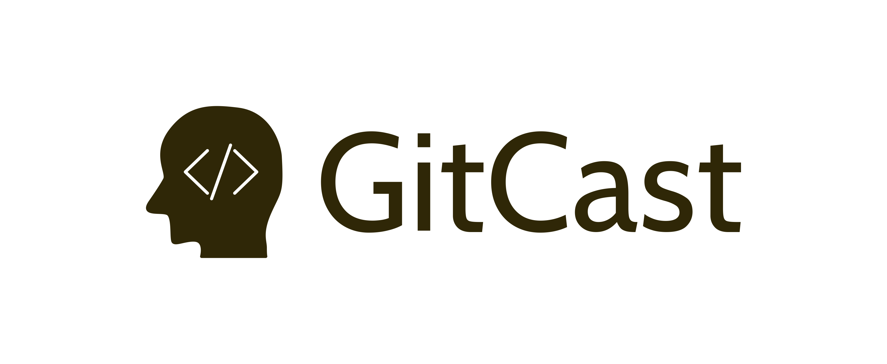

Logo projektu, pliki źródłowe i zrenderowane do wielkości bannera, ikony, do działań marketingowych
# Logotyp gitcast.pl
+ [Landing page: www.gitcast.pl](https://www.gitcast.pl/)
+ [Dokumentacja](https://docs.gitcast.pl/)
+ [Logo.gitcast.pl](https://logo.gitcast.pl/)

## Font
       
        Font in use <a target="_blank" href="https://fonts.google.com/specimen/Cabin">Cabin-Regular</a> designed by
        <a target="_blank" href="www.impallari.com">Impallari Type</a>
        and licensed under
        <a target="_blank" href="http://scripts.sil.org/cms/scripts/page.php?site_id=nrsi&amp;id=OFL_web">Open Font License.</a>
          Icon Designed by
          <a target="_blank" href="https://thenounproject.com/mb.icons">Med Marki</a>

## Font
  
    #2f2707

## Background

    transparent

## Icon
     
    #2f2707
    
    
## logo

## 1

## 2

